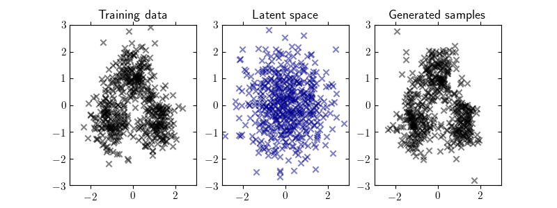

### Normalizing Flows Models

Last update: June 2019.

---

Implementations of simple normalizing flow models [1] in PyTorch.

We implement so far the following flows:
- Planar flows; 
- Radial flows; 
- Real NVP; affine coupling layer;  [2]
- Masked Autoregressive Flow (MAF);  [3]

Note that planar and radial flows admit no algebraic inverse.

Below we show an example using MAF to transform a mixture of Gaussians into a unit Gaussian.

#### References

[1] Rezende, D. J. & Mohamed, S. Variational Inference with Normalizing Flows. in Proceedings of the 32nd International Conference on Machine Learning - Volume 37 - Volume 37 1530–1538 (JMLR.org, 2015).

[2] Dinh, L., Krueger, D., and Bengio, Y. (2014). NICE: Non-linear Independent Components Estimation.

[3] Papamakarios, G., Pavlakou, T., and Murray, I. (2017). Masked Autoregressive Flow for Density Estimation. In Advances in Neural Information Processing Systems 30, I. Guyon, U.V. Luxburg, S. Bengio, H. Wallach, R. Fergus, S. Vishwanathan, and R. Garnett, eds. (Curran Associates, Inc.), pp. 2338–2347.

#### License

This code is available under the MIT License.
